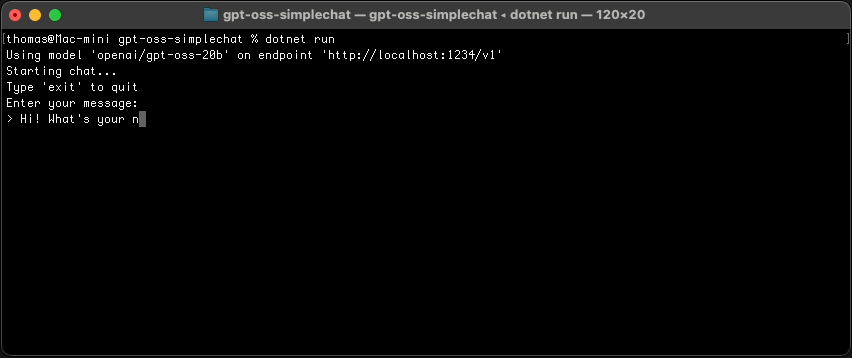

<!-- PROJECT LOGO -->
<div align="center">
  <h1 align="center">gpt-oss-simplechat</h1>
</div>

<!-- SHIELDS -->
<div align="center">

[![Contributors][contributors-shield]][contributors-url]
[![Forks][forks-shield]][forks-url]
[![Stargazers][stars-shield]][stars-url]
[![Issues][issues-shield]][issues-url]
[![MIT License][license-shield]][license-url]

</div>

# Introduction

A tiny .NET 9 console app that let's you chat with a local LLM (`gpt-oss-20b` by default) via LM Studio using the OpenAI-compatible API and `Microsoft.Extensions.AI` adapters. It streams responses and separates internal thoughts from the final answer.

<div align="center">
  <br/>
  <span>(Recorded on a Mac Mini M4 Pro with 24 GB RAM)</span>
</div>

## Requirements

- Windows, MacOS or Linux
- .NET 9 SDK
- LM Studio (or any OpenAI-compatible server) running locally
  - Default endpoint used in this app: `http://localhost:1234/v1`
  - Dummy API key is accepted by LM Studio: "lm-studio"
- For the oss-gpt-20b model at least 16 GB GPU VRAM or 16 GB Unified Memory on Apple Silicon (with less memory you can also use smaller models)

## Dependencies

This project uses the following NuGet packages (resolved via the csproj):
- Microsoft.Extensions.AI
- Microsoft.Extensions.AI.OpenAI
- OpenAI (Azure SDK client for OpenAI-compatible APIs)
- System.ClientModel

These assemblies appear in `bin/Debug/net9.0/` after build.

## How it works

- `Program.cs` constructs an OpenAI chat client pointed at the local endpoint and adapts it to `IChatClient`.
- User input is sent along with a small system prompt that asks the model to respond with <thought> and <answer> sections.
- Streaming deltas are parsed; only complete tagged sections are printed.

## Configure model and endpoint

Change these variables in `Program.cs` to match your local setup:
- `endpoint`: URI to your OpenAI-compatible server (LM Studio default is `http://localhost:1234/v1`).
- `apiKey`: For LM Studio, any non-empty string works (e.g. `"lm-studio"`).
- `modelId`: The model name exposed by your server (e.g. `openai/gpt-oss-20b`).

## Build

If you're using VS Code, a build task is provided. From the terminal:

```bash
dotnet build
```

## Run

Run the produced app (adjust path if using Release):

```bash
dotnet run
```

## Notes

- Make sure your local server is running and the model is loaded before starting the app, otherwise requests will fail.
- If your server requires a real API key, set `apiKey` accordingly or use an environment variable wiring as needed.

## Install LM Studio and the model

This repo provides helper scripts to install prerequisites and prepare LM Studio with the `gpt-oss-20b` model.

- On Linux or macOS: run `./install.sh` (ensures PowerShell 7, then calls the PowerShell installer)
- Alternatively, on macOS/Windows: run `pwsh -File ./install.ps1`

**Hardware note**: The `gpt-oss-20b` model requires more than 16 GB GPU VRAM. On Apple Silicon (Unified Memory), this means more than 16 GB system RAM. Otherwise, LMStudio may not be able to load it. If you try with --gpu=off it may be very slow.

What the installer does:

1) Installs LM Studio if missing
  - macOS: `brew install --cask lm-studio`
  - Windows: `winget install --id ElementLabs.LMStudio -e`
  - Linux: prompts to download the AppImage from https://lmstudio.ai/download

2) Ensures .NET 9 SDK is installed (winget/brew/dotnet-install)

3) Boots the `lms` CLI, starts the local server, and pulls the model
  - Starts LM Studio local server on port 1234
  - Downloads and loads `openai/gpt-oss-20b` (or a custom `-Model` argument)

Examples:

```bash
# Linux
chmod +x ./install.sh
./install.sh
```

```pwsh
# macOS or Windows
pwsh -File ./install.ps1
```

Choose a different model:

```pwsh
pwsh -File ./install.ps1 -Model "lmstudio-community/Phi-3.5-mini-instruct-GGUF/Phi-3.5-mini-instruct-Q4_K_M.gguf"
```

Tip: Use the exact GGUF filename shown on the model page in LM Studio to lock the quantization you want.

After the script completes, LM Studio’s OpenAI-compatible API should be available at:
http://localhost:1234/v1/

Then run the app:

```bash
dotnet run
```

## Donate

If you are using the tool but are unable to contribute technically, please consider promoting it and donating an amount that reflects its value to you. You can do so either via PayPal

[](https://www.paypal.com/donate/?hosted_button_id=JVG7PFJ8DMW7J)

or via [GitHub Sponsors](https://github.com/sponsors/thgossler).

## Contributing

Contributions are what make the open source community such an amazing place to learn, inspire, and create. Any contributions you make are **greatly appreciated**.

If you have a suggestion that would make this better, please fork the repo and create a pull request. You can also simply open an issue with the tag "enhancement".
Don't forget to give the project a star :wink: Thanks!

1. Fork the Project
2. Create your Feature Branch (`git checkout -b feature/AmazingFeature`)
3. Commit your Changes (`git commit -m 'Add some AmazingFeature'`)
4. Push to the Branch (`git push origin feature/AmazingFeature`)
5. Open a Pull Request

## License

This project is licensed under the MIT License - see the [LICENSE](LICENSE.txt) file for details.

<!-- MARKDOWN LINKS & IMAGES (https://www.markdownguide.org/basic-syntax/#reference-style-links) -->
[contributors-shield]: https://img.shields.io/github/contributors/thgossler/gpt-oss-simplechat.svg
[contributors-url]: https://github.com/thgossler/gpt-oss-simplechat/graphs/contributors
[forks-shield]: https://img.shields.io/github/forks/thgossler/gpt-oss-simplechat.svg
[forks-url]: https://github.com/thgossler/gpt-oss-simplechat/network/members
[stars-shield]: https://img.shields.io/github/stars/thgossler/gpt-oss-simplechat.svg
[stars-url]: https://github.com/thgossler/gpt-oss-simplechat/stargazers
[issues-shield]: https://img.shields.io/github/issues/thgossler/gpt-oss-simplechat.svg
[issues-url]: https://github.com/thgossler/gpt-oss-simplechat/issues
[license-shield]: https://img.shields.io/github/license/thgossler/gpt-oss-simplechat.svg
[license-url]: https://github.com/thgossler/gpt-oss-simplechat/blob/main/LICENSE
